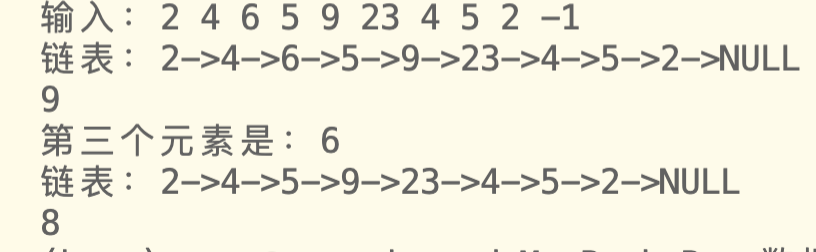
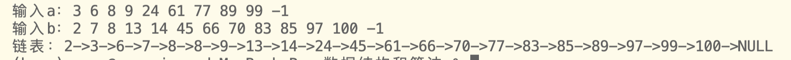

线性表的链式表示和实现

# 1 链表结构
链表由一个一个结点通过指针链接而成。
每个结点分为数据域与指针域
链表可以定义一个头结点，不储存数据，也可以没有头结点
该篇的链表是有头结点的
```c
typedef struct node //typedef 用于取别名
{
    ElemType data;
    struct node *next;
} * PNODE, NODE; //PNODE 就是 struct node *，NODE就是struct node

```

# 2 基本操作函数
1. 初始化单链表
产生一个头结点，返回指向头结点的头指针
```c
PNODE InitList()
{
    PNODE temp;                         //定义一个结构体指针
    temp = (PNODE)malloc(sizeof(NODE)); //定义一个头节点
    temp->next = NULL;                  //头结点不储存数据，头结点的指针域暂时为空
    return temp;
}
```

2. 清除单链表
传入链表头指针，依次调用free()清除

```c
void ListClear(PNODE head)
{
    PNODE p = head, temp;
    while (p != NULL)
    {
        temp = p->next;//用temp存下一个地址
        free(p);
        p = temp;
    }
}
```
3. 求单链表长度
传入链表头指针，依次遍历，用变量i统计
```c
int ListLength(PNODE head)
{
    int i = 0;
    PNODE p = head->next;
    while (p != NULL)
    {
        i++;
        p = p->next;
    }
    return i;
}
```
4. 判断单链表是否为空表
定义枚举类型bool，其中false=0,true=1。
```c
typedef enum
{
    false,
    true
} bool;
```

传入链表头指针，若长度=0，返回true（1），说明确实是空链表。反之长度不为0，返回false（0），说明链表不空。
```c
bool ListIsEmpty(PNODE head)
{
    return !ListLength(head);
}
```
5. 取单链表第pos位置上的元素
```c
ElemType ListGetData(PNODE head, int pos)
{
    PNODE p = head;

    //pos超过长度时报错
    if (ListLength(head) < pos)
    {
        printf("pos超过最大长度\n");
        return p->next->data;
    }

    for (int i = 0; i < pos; i++)
    {
        p = p->next;
    }

    return p->data;
}
```
6. 打印单链表(遍历)
```c
void ListPrint(PNODE head)
{
    printf("链表：");

    PNODE p = head->next; //定义p指向首元节点（不是头结点）
    while (p != NULL)     //直到p==NULL，遍历完了才结束
    {
        printf("%d->", p->data); //打印节点里的数据
        p = p->next;             //指针移动指向下一个节点
    }
    printf("NULL\n");
}
```
7. 向单链表插入一个元素
```c
bool ListInsertList(PNODE head, ElemType item, int pos)
{

    if (ListLength(head) + 1 < pos)
    {
        printf("pos超过最大长度+1\n");
        return false;
    }

    //开辟一小块内存用于存放数据
    PNODE temp, p = head;
    temp = (PNODE)malloc(sizeof(NODE));
    temp->data = item;

    //找到第(pos-1)个结点,让p指向它
    for (int i = 0; i < pos - 1; i++)
    {
        p = p->next;
    }

    //插入
    temp->next = p->next;
    p->next = temp;

    return true;
}
```
8. 在单链表中删除一元素
```c
bool ListDeleteList(PNODE head, int pos)
{
    PNODE p = head;

    if (ListLength(head) + 1 < pos)
    {
        printf("pos超过最大长度+1\n");
        return false;
    }

    //找到第(pos-1)个结点,让p指向它
    for (int i = 0; i < pos - 1; i++)
    {
        p = p->next;
    }

    //让pos-1个结点直接指向pos+1个结点
    p->next = p->next->next;

    free(p->next);
    return true;
}
```

# 3 整体代码
该程序分为两个文件，"LinkList.h"与"test2.c"            
将数据结构类型定义（typedef）部分与基础操作函数放在头文件`LinkList.h`          
主函数以及其他部分放在`test2.c `中 

## test2.c

- 为检验代码可行性，设计main()函数验证
- 功能：
  - 接收元素组成链表，打印链表，计算长度
  - 删除第三个链表元素，再次打印链表，计算长度

```c
#include <stdio.h>
#include <stdlib.h>

typedef int ElemType;   //定义数据类型

#include "LinkList.h"  //调用头文件

int main()
{
    PNODE head =InitList(); //接受InitList（）的返回值，即head指向了一个头结点

    ElemType x;
    int i = 1;

    printf("输入：");
    scanf("%d", &x);
    while (x != -1)
    {
        if (ListInsertList(head, x, i) == 0)
        {
            return 0;
        }
        i++;
        scanf("%d", &x);
    }


    ListPrint(head);
    printf("%d\n", ListLength(head));

    printf("第三个元素是：%d\n", ListGetData(head, 3));
    ListDeleteList(head,3);

    ListPrint(head);
    printf("%d\n", ListLength(head));

    return 0;
}

```

## LinkList.h
```c
typedef enum
{
    false,
    true
} bool;

typedef struct node //typedef 用于取别名
{
    ElemType data;
    struct node *next;
} * PNODE, NODE; //PNODE 就是 struct node *，NODE就是struct node

//初始化单链表
PNODE InitList()
{
    PNODE temp;                         //定义一个结构体指针
    temp = (PNODE)malloc(sizeof(NODE)); //定义一个头节点
    temp->next = NULL;                  //头结点不储存数据，头结点的指针域暂时为空
    return temp;
}

//清除单链表
void ListClear(PNODE head)
{
    PNODE p = head, temp;
    while (p != NULL)
    {
        temp = p->next;
        free(p);
        p = temp;
    }
}

//求单链表长度
int ListLength(PNODE head)
{
    int i = 0;
    PNODE p = head->next;
    while (p != NULL)
    {
        i++;
        p = p->next;
    }
    return i;
}

//判断单链表是否为空表
bool ListIsEmpty(PNODE head)
{
    return !ListLength(head);
}

//取单链表第pos位置上的元素
ElemType ListGetData(PNODE head, int pos)
{
    PNODE p = head;

    //pos超过长度时报错
    if (ListLength(head) < pos)
    {
        printf("pos超过最大长度\n");
        return p->next->data;
    }

    for (int i = 0; i < pos; i++)
    {
        p = p->next;
    }

    return p->data;
}

//打印单链表(遍历)
void ListPrint(PNODE head)
{
    printf("链表：");

    PNODE p = head->next; //定义p指向首元节点（不是头结点）
    while (p != NULL)     //直到p==NULL，遍历完了才结束
    {
        printf("%d->", p->data); //打印节点里的数据
        p = p->next;             //指针移动指向下一个节点
    }
    printf("NULL\n");
}

//向单链表插入一个元素
bool ListInsertList(PNODE head, ElemType item, int pos)
{

    if (ListLength(head) + 1 < pos)
    {
        printf("pos超过最大长度+1\n");
        return false;
    }

    //开辟一小块内存用于存放数据
    PNODE temp, p = head;
    temp = (PNODE)malloc(sizeof(NODE));
    temp->data = item;

    //找到第(pos-1)个结点,让p指向它
    for (int i = 0; i < pos - 1; i++)
    {
        p = p->next;
    }

    //插入
    temp->next = p->next;
    p->next = temp;

    return true;
}

bool ListDeleteList(PNODE head, int pos)
{
    PNODE p = head;

    if (ListLength(head) + 1 < pos)
    {
        printf("pos超过最大长度+1\n");
        return false;
    }

    //找到第(pos-1)个结点,让p指向它
    for (int i = 0; i < pos - 1; i++)
    {
        p = p->next;
    }

    //让pos-1个结点直接指向pos+1个结点
    p->next = p->next->next;

    free(p->next);
    return true;
}

void ListMergeList(PNODE La, PNODE Lb, PNODE Lc)
{
    //让pa指向La最后一个结点
    PNODE pa = La->next;
    PNODE pb = Lb->next;
    PNODE pc = Lc;

    if (pa->data < pb->data)
    {
        pc->next = pa;
        pa = pa->next;
        pc = pc->next;
    }
    else
    {
        pc->next = pb;
        pb = pb->next;
        pc = pc->next;
    }

    //pa pb至少有一个存在就能继续
    while (pa!=NULL || pb!=NULL)
    {
        //只有一个存在
        if ((pa!= NULL && pb== NULL)||(pa== NULL && pb!= NULL) )
        {
            //如果pa存在
            if (pa!= NULL)
            {
                pc->next = pa;
                pa = pa->next;
                pc = pc->next;
            }
            else
            {
                pc->next = pb;
                pb = pb->next;
                pc = pc->next;
            }
        }
        else
        {
            if (pa->data < pb->data)
            {
                pc->next = pa;
                pa = pa->next;
                pc = pc->next;
            }
            else
            {
                pc->next = pb;
                pb = pb->next;
                pc = pc->next;
            }
        }

        ListClear(La);
        ListClear(Lb);
    }
}

```

# 4 运行结果


# 5 附加题
- 合并两个`有序`链表
- 编写一个函数`void ListMergeListPlus(PNODE La, PNODE Lb, PNODE Lc)`，实现将两个有序单链表La和 Lb合并成一个新的有序单链表Lc，同时销毁原有单链表La和Lb。要求把该函数添加到文件`LinkList.h`中，并在主函数文件`test2.c`中添加相应语句进行测试。
- 步骤：
  - 刚开始先定义pa、pb指向La、Lb首元结点，pc 指向Lc头结点
  - pa、pb都存在时就依次比较，谁小，就加入Lc（变成pc指向结点的next域），同时pa/pb指向链表La/pb下一个，pc也指向链表Lc下一个
  - 最后可能存在有剩余的情况（`La全添入Lc，Lb还没有`或者`Lb全添入Lc，La还没有`）,只要修改pc->next就行
- 添入`LinkList.h`
```c
void ListMergeListPlus(PNODE La, PNODE Lb, PNODE Lc)
{
    //让pa指向La首元结点（头结点后一个）
    PNODE pa = La->next;
    PNODE pb = Lb->next;
    PNODE pc = Lc;

    //pa pb两个都存在就能继续
    while (pa && pb)
    {
        if (pa->data < pb->data)
        {
            pc->next = pa;
            pa = pa->next;
            pc = pc->next;
        }
        else
        {
            pc->next = pb;
            pb = pb->next;
            pc = pc->next;
        }   
    }

    if(pa)
    {
        pc->next = pa;
    }
    if(pb)
    {
        pc->next = pb;
    }

}
```
- 主函数
  - 修改test2.c
  - 输入a链表与b链表
  - 合并为c链表
  - 打印c链表
```c
#include <stdio.h>
#include <stdlib.h>

typedef int ElemType;

#include "LinkList.h"

int main()
{
    PNODE heada= InitList(),headb= InitList(),headc = InitList();//接受InitList（）的返回值，即head指向了一个头结点

    ElemType x;
    int i = 1;

    printf("输入a：");
    scanf("%d", &x);
    while (x != -1)
    {
        if (ListInsertList(heada, x, i) == 0)
        {
            return 0;
        }
        i++;
        scanf("%d", &x);
    }

    i = 1;  //重置i
    printf("输入b：");
    scanf("%d", &x);
    while (x != -1)
    {
        if (ListInsertList(headb, x, i) == 0)
        {
            return 0;
        }
        i++;
        scanf("%d", &x);
    }
    
    
    ListMergeListPlus(heada,headb,headc);
    ListPrint(headc);

    return 0;
}


```

- `注意：输入的两个链表要是有序链表`

- 运行结果
