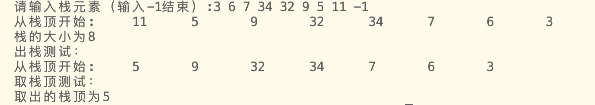
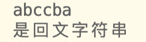
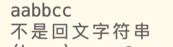

栈的顺序表示和实现
栈的存储结构可以是顺序表或链表，该篇为顺序表存储
栈是后进先出的数据结构

# 1 顺序栈结构
栈结构体
`top永远指向下一个`
```c
typedef struct Stack
{                       
    DataType data[maxn]; // 作为栈元素的存储方式，数据类型为DataType
    int top;             // top即栈顶指针，data[top-1]表示栈顶元素，top==0代表空栈
    int base;            // base即栈底指针
} Stack;                 //构建一个名字是stack类型的结构体，包含三个部分
```

# 2 基本操作函数
1. 初始化一个栈
返回一个结构体指针，空栈
```c
Stack *InitStack()
{
    Stack *p = (Stack *)malloc(sizeof(Stack));
    if (p == NULL)
        return NULL;         //分配失败返回空指针
    p->base = p->top = 0; //栈底等于栈顶 即建立一个空栈
    return p;
}
```

2. 入栈
定义枚举类型bool，其中false=0,true=1。
```c
typedef enum
{
    false,
    true
} bool;
```
- 传入栈的结构体指针，以及传入元素，从栈顶加入栈，top+1,`top永远指向下一个`
- 成功返回true，失败返回false
```c
bool StackPushStack(Stack *p, DataType dt)
{
    if (p->top - p->base == maxn)
        return false;
    p->data[p->top] = dt; // dt存入栈中
    p->top++;             // 栈顶指针+1
    return true;
}

```

3. 出栈
传入栈的结构体指针，从栈顶移除该元素，top-1
```c
bool StackPopStack(Stack *p)
{
    if (p->base == p->top)
        return false;
    --p->top;
    return true;
}
```

4. 清空栈
```c
void StackClear(Stack *p)
{
    p->top = 0; // 栈顶指针指向栈底
}
```

5. 获取栈顶元素
```c
DataType StackGetTop(Stack *p)
{
    return p->data[p->top - 1]; //  数组中栈元素从 0 开始计数，所以实际获取元素时，下标为 栈顶元素下标 减一；
}
```

6. 获取栈大小
```c
int StackGetSize(Stack *p)
{
    return p->top; //  因为只有在入栈的时候，栈顶指针才会加一，所以它正好代表了栈元素个数；
}
```

7. 栈的判空
```c
bool StackIsEmpty(Stack *p)
{
    return !StackGetSize(p); //判断是否为空栈
}

```

8. 打印栈
```c
void PrintStack(Stack *p)
{
    if (StackIsEmpty(p))
    {
        printf("栈为空\n");
    }
    else
    {
        printf("从栈顶开始:\t");
        for (int i = 1; i <= StackGetSize(p); i++)
        {
            printf("%d\t", p->data[p->top - i]);
        }
    }
}

```

# 3 整体代码
该程序分为两个文件，"Stack.h"与"test3.c"            
将数据结构类型定义（typedef）部分与基础操作函数放在头文件`Stack.h`          
主函数以及其他部分放在`test3.c `中 

## test3.c

- 为检验代码可行性，设计main()函数验证
- 功能：
  - 往栈输入数据
  - 打印测试，依次打印栈元素（从栈顶开始）
  - 栈大小测试，返回栈的大小
  - 出栈测试，栈顶元素出栈
  - 取栈顶测试，返回栈顶元素

```c
#include <stdio.h>
#include <stdlib.h>

#define DataType int // DataType用这个宏定义来统一代表栈中数据的类型，这里将它定义为整型，根据需要可以定义成其它类型，例如浮点型、字符型、结构体 等等；
#define maxn 1005  // 代表我们定义的栈的最大元素个数

#include "Stack.h"


int main()
{  
    DataType e;
    Stack *p = InitStack();
    printf("请输入栈元素（输入-1结束）:");
    scanf("%d", &e);
    while (e != -1)
    {
        StackPushStack(p, e);
        //printf("请输入栈元素（输入-1结束）:");
        scanf("%d", &e);
    }
    PrintStack(p);
    printf("\n");
    printf("栈的大小为%d\n", StackGetSize(p));
    
    printf("出栈测试：\n");
    StackPopStack(p);
    PrintStack(p);

    printf("\n");
    printf("取栈顶测试：\n");
    e = StackGetTop(p);
    printf("取出的栈顶为%d\n", e);

    return 0;
}

```


## Stack.h
```c
typedef enum
{
    false,
    true
} bool;

typedef struct Stack
{                        // 栈结构体
    DataType data[maxn]; // 作为栈元素的存储方式，数据类型为DataType
    int top;             // top即栈顶指针，data[top-1]表示栈顶元素，top==0代表空栈
    int base;            // base即栈底指针
} Stack;                 //构建一个名字是stack类型的结构体，包含三个部分


//初始化一个栈
Stack *InitStack()
{
    Stack *p = (Stack *)malloc(sizeof(Stack));
    if (p == NULL)
        return NULL;         //分配失败返回空指针
    p->base = p->top = 0; //栈底等于栈顶 即建立一个空栈
    return p;
}

//入栈
bool StackPushStack(Stack *p, DataType dt)
{
    if (p->top - p->base == maxn)
        return false;
    p->data[p->top] = dt; // dt存入栈中
    p->top++;             // 栈顶指针+1
    return true;
}

//出栈
bool StackPopStack(Stack *p)
{
    if (p->base == p->top)
        return false;
    --p->top;
    return true;
}

//清空栈
void StackClear(Stack *p)
{
    p->top = 0; // 栈顶指针指向栈底
}

// 只读接口，获取栈顶元素，获取栈大小，栈的判空, 打印栈
DataType StackGetTop(Stack *p)
{
    return p->data[p->top - 1]; //  数组中栈元素从 0 开始计数，所以实际获取元素时，下标为 栈顶元素下标 减一；
}
int StackGetSize(Stack *p)
{
    return p->top; //  因为只有在入栈的时候，栈顶指针才会加一，所以它 正好代表了 栈元素个数；
}
bool StackIsEmpty(Stack *p)
{
    return !StackGetSize(p); //判断是否为空栈
}
void PrintStack(Stack *p)
{
    if (StackIsEmpty(p))
    {
        printf("栈为空\n");
    }
    else
    {
        printf("从栈顶开始:\t");
        for (int i = 1; i <= StackGetSize(p); i++)
        {
            printf("%d\t", p->data[p->top - i]);
        }
    }
}
```

# 4 运行结果


# 5 附加题
- 判断回文字符串
- 写一函数，判断给定的字符串是否中心对称。如字符串“abcba”、“abccba”均为中心对称，字符串“abcdba”不中心对称。要求利用`Stack.h`中已实现的有关栈的基本操作函数来实现。请把该函数添加到文件`test3.c`中的主函数前，并在主函数中添加相应语句进行测试。要求是回文串返回1，不是为0。
- 步骤
  - 字符串前半部分依次入栈
  - 利用栈后进先出的特点，字符串后半部分依次与栈顶元素比较，比较一次，进行出栈操作一次
  - 难点在字符串中字符个数有奇偶之分，需要讨论，或者像我利用mid和len两个变量控制，能将两个情况合并起来。
```c
int IsReverse(char *s)
{
    int mid,len;
    Stack *q = InitStack();

    len = strlen(s);
    mid = strlen(s)/2;

    for (int i = 0; i < mid; i++)
    {
        StackPushStack(q, s[i]);
    }

    for (int i = len%2?mid+1:mid ; i < len; i++)
    {
        if (StackGetTop(q) != s[i])
        {
            return 0;
        }       
        StackPopStack(q);
    }

    return 1;
}
```
  
- 修改test3.c
```c
#include <stdio.h>
#include <stdlib.h>
#include <string.h>

#define DataType int // DataType用这个宏定义来统一代表栈中数据的类型，这里将它定义为整型，根据需要可以定义成其它类型，例如浮点型、字符型、结构体 等等；
#define maxn 1005  // 代表我们定义的栈的最大元素个数

#include "Stack.h"


int IsReverse(char *s)
{
    int mid,len;
    Stack *q = InitStack();

    len = strlen(s);
    mid = strlen(s)/2;

    for (int i = 0; i < mid; i++)
    {
        StackPushStack(q, s[i]);
    }

    for (int i = len%2?mid+1:mid ; i < len; i++)
    {
        if (StackGetTop(q) != s[i])
        {
            return 0;
        }       
        StackPopStack(q);
    }

    return 1;
}

int main()
{  
    char s[15]; 
    scanf("%s",s);
    if(IsReverse(s)) printf("是回文字符串\n");
    else printf("不是回文字符串\n");

    return 0;
}

```
- 运行结果

