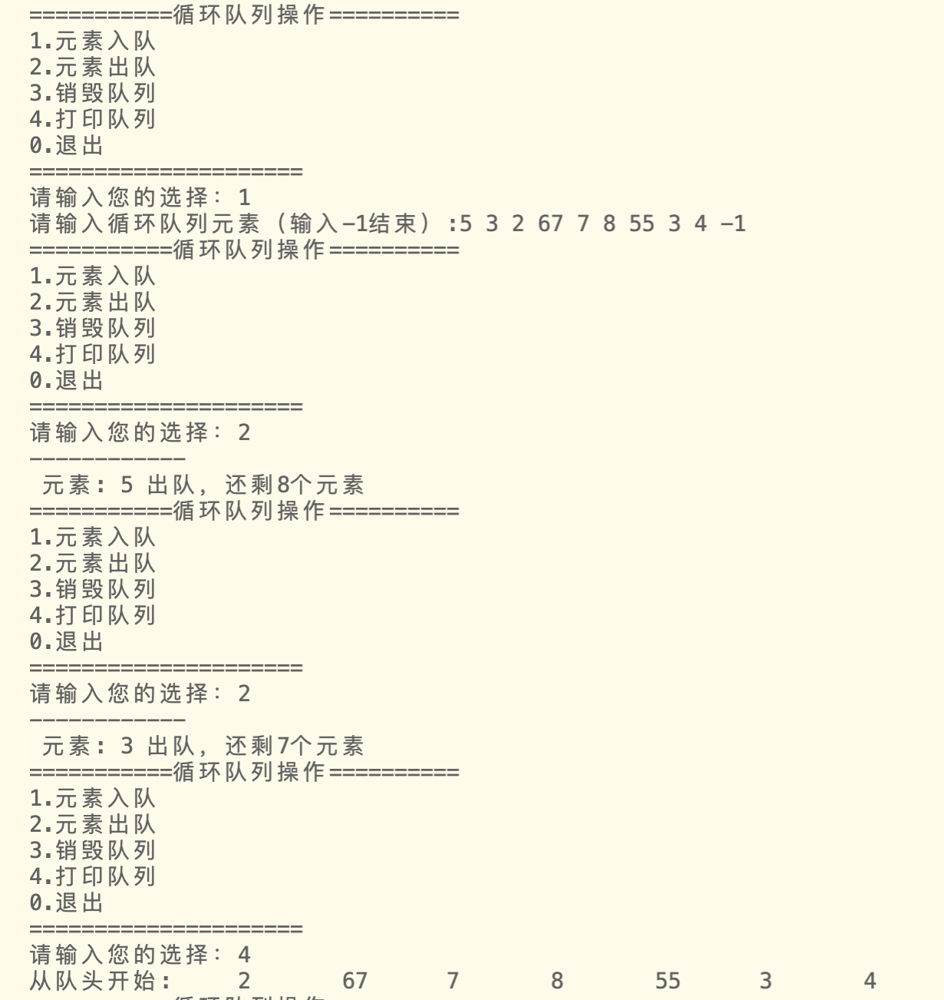
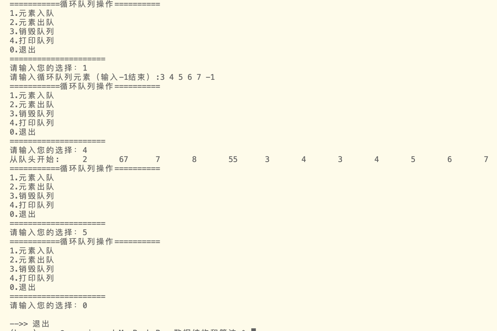
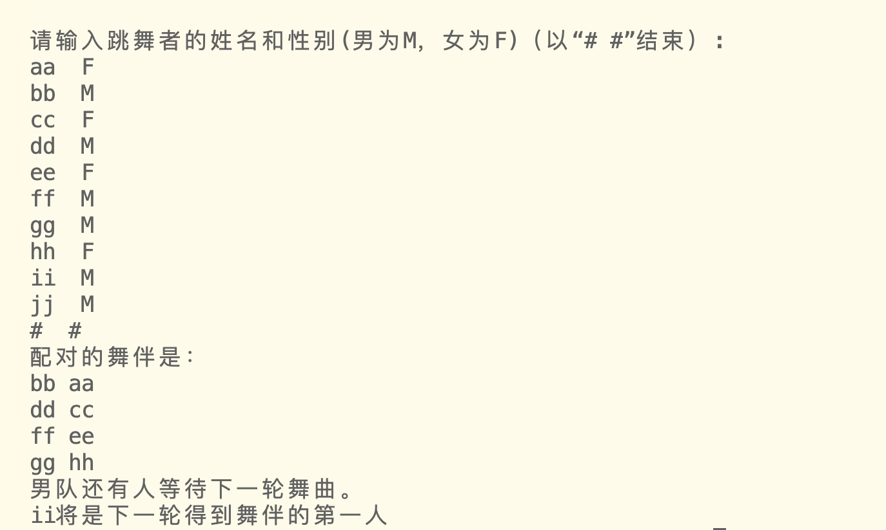

定义顺序存储的循环队列存储结构
编写循环队列的各种基本操作实现函数
队列是先进先出的结构
front指向队头，元素出队
rear指向队尾，元素入队

# 1 循环队列结构
```c
typedef struct LoopQueue
{
    DataType data[MAXSIZE];
    int front; //队头索引，指向队列第一个数据所在位置
    int rear;  //队尾索引，指向队列最后一个数据后一个位置
} LoopQueue;
```

# 2 基本操作函数
1. 初始化队列
返回一个结构体指针，指向一个空的循环队列
```c
LoopQueue *InitLQueue()
{
    LoopQueue *Q = (LoopQueue *)malloc(sizeof(LoopQueue));
    Q->front = Q->rear = 0;
    return Q;
}
```

2. 计算队列长度
   
```c
int LQueueGetLenth(LoopQueue *Q)
{
    return (Q->rear - Q->front + MAXSIZE) % MAXSIZE;
}
```

3. 元素入队
- 定义枚举类型bool，其中false=0,true=1。
```c
typedef enum
{
    false,
    true
} bool;
```

```c
bool LQueueInsert(LoopQueue *Q, DataType dt)
{
    //这里牺牲掉了一个储存位置，用rear+1来和队头索引相比较以判断是否为满，
    //是为了和队列判空条件相区分

    //判断队列是否 满，如果已满，返回false
    if ((Q->rear + 1) % MAXSIZE == Q->front)
        return false;

    Q->data[Q->rear] = dt;
    Q->rear = (Q->rear + 1) % MAXSIZE;
    return true;
}
```

4. 元素出队，返回其值

```c
DataType LQueueDelete(LoopQueue *Q)
{
    //判断队列是否为空,若空报错
    if (Q->rear == Q->front)
    {
        printf("列表为空\n");
        return 0;
    }

    DataType dt = Q->data[Q->front];
    Q->front = (Q->front + 1) % MAXSIZE;
    return dt;
}
```

5. 销毁队列
销毁队列,也是由于该循环队列基于数组，不需要分配内存
只需重置队头和队尾索引即可
```c

int LQueueDestroy(LoopQueue *Q)
{
    Q->front = Q->rear = 0;
    return true;
}
```

6. 打印队列

```c
void LQueuePrint(LoopQueue *Q)
{
    if (Q->rear == Q->front)
        printf("队列为空\n");
    else
    {·
        //只要队列不为空 ，就从队头开始打印
        int p = Q->front;
        printf("从队头开始:\t");
        while (p != Q->rear)
        {
            printf("%d\t", Q->data[p]);
            p = (p + 1) % MAXSIZE;
        }
        printf("\n");
    }
}
```

7. 取队头元素

```c
DataType LQueuePeek(LoopQueue *Q)
{
    if (Q->rear == Q->front)
        printf("队列为空\n");
    else
        return Q->data[Q->front];
    return 0;
}
```

# 3 整体代码
该程序分为两个文件，"LQueue.h"与"test4.c"            
将数据结构类型定义（typedef）部分与基础操作函数放在头文件`LQueue.h`          
主函数以及其他部分放在`test4.c `中 

## test4.c

- 为检验代码可行性，设计main()函数验证
- 功能：
  - 可以选择元素入队，出队，销毁和打印

```c
#include <stdio.h>
#include <stdlib.h>
#include <string.h>


#define DataType int
#define MAXSIZE 100

#include "LQueue.h"


int main()
{    
    //测试部分
    LoopQueue *Q;

    Q = InitLQueue();
   
    //定义一个选择变量
    int choice;

    //插入元素
    DataType e;

    //出队返回值
    DataType back;
    do
    {
        printf("===========循环队列操作==========\n");
        printf("1.元素入队\n");
        printf("2.元素出队\n");
        printf("3.销毁队列\n");
        printf("4.打印队列\n");
        printf("0.退出\n");
        printf("=====================\n");
        printf("请输入您的选择：");
        scanf("%d", &choice);
        switch (choice)
        {
        case 1:
            
            printf("请输入循环队列元素（输入-1结束）:");
            scanf("%d", &e);
            while (e != -1)
            {
                LQueueInsert(Q, e);
                scanf("%d", &e);
            }
            break;
        case 2:

            back = LQueueDelete(Q);
            back ? printf("------------\n 元素: %d 出队，还剩%d个元素\n", back, LQueueGetLenth(Q)) : printf("------------\n队列为空，无法出队！\n");
            free(&back); //回收内存，防止内存泄露
            break;
        case 3:
            LQueueDestroy(Q) ? printf("------------\n队列销毁成功！\n") : printf("------------\n队列销毁失败！\n");
            break;
        case 4:
            LQueuePrint(Q);
            break;
        case 0:
            printf("\n-->> 退出\n");
            exit(0);
            break;
        default:
            break;
        }
    } while (choice);


    return 0;
}

```

## LQueue.h

```c


typedef enum
{
    false,
    true
} bool;

//循环队列结构
typedef struct LoopQueue
{
    DataType data[MAXSIZE];
    int front; //队头索引，指向队列第一个数据所在位置
    int rear;  //队尾索引，指向队列最后一个数据后一个位置
} LoopQueue;

LoopQueue *InitLQueue()
{
    LoopQueue *Q = (LoopQueue *)malloc(sizeof(LoopQueue));
    Q->front = Q->rear = 0;
    return Q;
}

//返回长度
int LQueueGetLenth(LoopQueue *Q)
{
    return (Q->rear - Q->front + MAXSIZE) % MAXSIZE;
}

//元素入队
bool LQueueInsert(LoopQueue *Q, DataType dt)
{
    //这里牺牲掉了一个储存位置，用rear+1来和队头索引相比较以判断是否为满，
    //是为了和队列判空条件相区分

    //判断队列是否 满，如果已满，返回false
    if ((Q->rear + 1) % MAXSIZE == Q->front)
        return false;

    Q->data[Q->rear] = dt;
    Q->rear = (Q->rear + 1) % MAXSIZE;
    return true;
}

//元素出队，返回其值
DataType LQueueDelete(LoopQueue *Q)
{
    //判断队列是否为空
    if (Q->rear == Q->front)
    {
        printf("列表为空\n");
        return 0;
    }
    DataType dt = Q->data[Q->front];
    Q->front = (Q->front + 1) % MAXSIZE;
    return dt;
}

//销毁队列,也是由于该循环队列基于数组，不需要分配内存
//只需重置队头和队尾索引即可
int LQueueDestroy(LoopQueue *Q)
{
    Q->front = Q->rear = 0;
    return true;
}

//打印队列
void LQueuePrint(LoopQueue *Q)
{
    if (Q->rear == Q->front)
        printf("队列为空\n");
    else
    {
        //只要队列不为空 ，就从队头开始打印
        int p = Q->front;
        printf("从队头开始:\t");
        while (p != Q->rear)
        {
            printf("%d\t", Q->data[p]);
            p = (p + 1) % MAXSIZE;
        }
        printf("\n");
    }
}

//取队头元素
DataType LQueuePeek(LoopQueue *Q)
{
    if (Q->rear == Q->front)
        printf("队列为空\n");
    else
        return Q->data[Q->front];
    return 0;
}


```

# 4 运行结果
- 示例：
  - 先入队，进行两次出队，打印队列
  - 再次入队一些元素，再打印队列



# 5 附加题
- 舞伴匹配问题
- 编写程序，实现舞伴问题：假设在周末舞会上，男士们和女士们进入舞厅时，各自排成一队，跳舞开始时，依次从男队和女队的队头上各出一人配成舞伴，若两队初始人数不相同，则较长的那一队中未配对者等待下一轮舞曲。现要求设计一个函数`void partner()`，模拟上述舞伴配对问题。
- 基本要求:
    1. 由键盘输入数据，每对数据包括姓名和性别；
    2. 输出结果包括配成舞伴的女士和男士的姓名，以及未配对者的队伍名称和队头者的姓名； 
    3. 要求利用LQueue.h中已实现的顺序循环队列的基本操作函数来实现。函数void partner() 添加到文件test4.c中，在主函数中进行调用测试。  

- 步骤
  - 由于该问题存储的数据元素是字符串，所以需要改变，文件修改保存为`LQueuePlus.h`和`test4Plus`
  - 创建两个队列，分别储存男人和女人
  - 一个一个出队匹配，直到其中一个队列为0

## LQueuePlus.h
```c
typedef enum
{
    false,
    true
} bool;

//循环队列结构
typedef struct LoopQueue
{
    char data[MAXSIZE][5];
    int front; //队头索引，指向队列第一个数据所在位置
    int rear;  //队尾索引，指向队列最后一个数据后一个位置
} LoopQueue;

LoopQueue *InitLQueue()
{
    LoopQueue *Q = (LoopQueue *)malloc(sizeof(LoopQueue));
    Q->front = Q->rear = 0;
    return Q;
}

//返回长度
int LQueueGetLenth(LoopQueue *Q)
{
    return (Q->rear - Q->front + MAXSIZE) % MAXSIZE;
}

//插入元素
bool LQueueInsert(LoopQueue *Q, char *dt)
{
    //这里牺牲掉了一个储存位置，用rear+1来和队头索引相比较以判断是否为满，
    //是为了和队列判空条件相区分

    //判断队列是否 满，如果已满，返回false
    if ((Q->rear + 1) % MAXSIZE == Q->front)
        return false;

    strcpy(Q->data[Q->rear], dt);
    Q->rear = (Q->rear + 1) % MAXSIZE;
    return true;
}

//元素出队，返回其值
char *LQueueDelete(LoopQueue *Q)
{
    //判断队列是否为空
    if (Q->rear == Q->front)
        return NULL;

    char *dt = Q->data[Q->front];
    Q->front = (Q->front + 1) % MAXSIZE;
    return dt;
}

//销毁队列,也是由于该循环队列基于数组，不需要分配内存
//只需重置队头和队尾索引即可
int LQueueDestroy(LoopQueue *Q)
{
    Q->front = Q->rear = 0;
    return true;
}

//打印队列
void LQueuePrint(LoopQueue *Q)
{
    if (Q->rear == Q->front)
        printf("队列为空\n");
    else
    {
        //只要队列不为空 ，就从队头开始打印
        int p = Q->front;
        printf("从队头开始:\t");
        while (p != Q->rear)
        {
            printf("%s\t", Q->data[p]);
            p = (p + 1) % MAXSIZE;
        }
        printf("\n");
    }
}

//取队头元素
char *LQueuePeek(LoopQueue *Q)
{
    if (Q->rear == Q->front)
        printf("队列为空\n");
    else
        return Q->data[Q->front];
    return 0;
}
```

## test4Plus.h
```c
#include <stdio.h>
#include <stdlib.h>
#include <string.h>


#define MAXSIZE 100

#include "LQueuePlus.h"

bool partner()
{
    //创建两个队列，分别储存男女两队
    LoopQueue *M = InitLQueue();
    LoopQueue *F = InitLQueue();

    //传入人名
    char str1[5],str2[2];
    printf("请输入跳舞者的姓名和性别(男为M，女为F)（以“# #”结束）:\n");
    scanf("%s%s", str1, str2);
    getchar();
    while (strcmp(str1 ,"#") && strcmp(str2 ,"#"))
    {
        if (!strcmp(str2 ,"M"))
        {
            LQueueInsert(M, str1);
        } 
        else if(!strcmp(str2 ,"F"))
        {
            LQueueInsert(F, str1);
        }
        else
        {
            printf("输入不合法");
            return false;
        }

        //printf("请输入跳舞者的姓名和性别(男为M，女为F)（以“# #”结束）:");
        scanf("%s%s", str1, str2);   
        getchar();     
    }


    //配对
    int num, i;
    printf("配对的舞伴是：\n");
    num = LQueueGetLenth(M)<LQueueGetLenth(F)?LQueueGetLenth(M):LQueueGetLenth(F);
    for (i = 0; i < num; i++)
    {
        printf("%s %s" , LQueueDelete(M), LQueueDelete(F));   
        printf("\n");
    }


    //M剩余或F剩余或都不剩余
    if (LQueueGetLenth(M)) 
    {
        //还有男的
        printf("男队还有人等待下一轮舞曲。\n");
        printf("%s将是下一轮得到舞伴的第一人\n", LQueuePeek(M));
    }
    else if (LQueueGetLenth(F)) 
    {
        //还有女的
        printf("女队还有人等待下一轮舞曲。\n");
        printf("%s将是下一轮得到舞伴的第一人\n", LQueuePeek(F));
    }
    else
        printf("无人剩余，全部匹配成功！\n");
    
    return true;
}


int main()
{
    //舞伴问题
    partner();
    
    return 0;
}

```

- 运行结果



