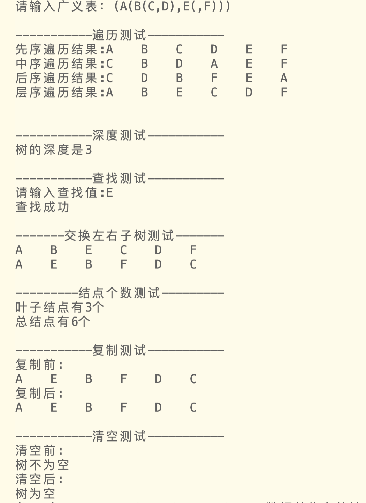

二叉树的基本操作
    1. 掌握二叉树的链式存储结构。
    2. 掌握在二叉链表上的二叉树操作的实现原理与方法。
    3. 进一步掌握递归算法的设计方法。

# 1 二叉树结点结构
一个数据域、一个左孩子、一个右孩子
```c
typedef struct BTreeNode {
    DataType data;
    struct BTreeNode *left;
    struct BTreeNode *right;
}BTreeNode;
```


# 2 基本操作函数
1. 初始化二叉树
返回一个结构体指针，指向一个空的头结点
```c
BTreeNode *InitBTree()
{
    BTreeNode *BT = (BTreeNode *)malloc(sizeof(BTreeNode));
    BT->left = NULL;
    BT->right = NULL;

    return BT;
}
```

2. 建立二叉树
根据字符串a所给出的广义表表示的二叉树建立二叉链表存储结构
利用栈
传入的BT，作为指向头结点的指针，不需要初始化init，只需要是结构体指针
```c
BTreeNode *BTreeCreate(BTreeNode *BT, char *a)
{
    //指针数组存储双亲结点
    BTreeNode *S[MAXSIZE];
    //用于生成新结点
    BTreeNode *p = NULL;

    BT = NULL;

    int top = 0, k = 0, j = 0;
    char ch;

    ch = a[j];
    while (ch != '\0')
    {
        switch (ch)
        {
        case '(':
            S[top++] = p;
            k = 1;
            break;
        case ')':
            top--;
            break;
        case ',':
            k = 2;
            break;

        default:
            p = InitBTree();
            p->data = ch;
            //如果是头结点
            if (BT == NULL)
            {
                BT = p;
            }
            else
            {
                //不是头结点
                if (k == 1)
                {
                    S[top - 1]->left = p;
                }
                else
                {
                    S[top - 1]->right = p;
                }
                break;
            }
        }
        ch = a[++j];
    }
    return BT;
}
```
3. 二叉树判空
检查二叉树BT是否为空，空返回1，否则返回0
- 定义枚举类型bool，其中false=0,true=1。
```c
typedef enum
{
    false,
    true
} bool;
```

```c

bool BTreeIsEmpty(BTreeNode *BT)
{
    if (BT&&BT->left&&BT->right)  //说明2
    {
        return false;
    }
    else
    {
        return true;
    }
}
```

4. 求深度

```c
//求二叉树BT的深度并返回该值
int BTreeDepth(BTreeNode *BT)
{
    if (BT == NULL)
    {
        return 0;
    }
    else
    {
        int MaxLeft = BTreeDepth(BT->left);
        int MaxRight = BTreeDepth(BT->right);
        int MaxDepth = MaxLeft < MaxRight ? MaxRight : MaxLeft;
        return 1 + MaxDepth; //双亲结点加上最深子树的深度
    }
}
```

5. 先序遍历

```c
//先序遍历
void BTreePreOrderTraverse(BTreeNode *BT)
{
    if (BT)
    {
        printf("%-5c", BT->data);         //输出双亲结点
        BTreePreOrderTraverse(BT->left);  //遍历左孩子
        BTreePreOrderTraverse(BT->right); //遍历右孩子
    }
}
```

6. 中序遍历

```c
//中序遍历
void BTreeInOrderTraverse(BTreeNode *BT)
{
    if (BT)
    {
        BTreeInOrderTraverse(BT->left);  //遍历左孩子
        printf("%-5c", BT->data);        //输出双亲结点
        BTreeInOrderTraverse(BT->right); //遍历右孩子
    }
}
```

7. 后序遍历

```c
//后序遍历
void BTreePostOrderTraverse(BTreeNode *BT)
{
    if (BT)
    {
        BTreePostOrderTraverse(BT->left);  //遍历左孩子
        BTreePostOrderTraverse(BT->right); //遍历右孩子
        printf("%-5c", BT->data);          //输出双亲结点
    }
}
```

8. 层序遍历
层序遍历有递归写法和非递归写法，这里采用非递归。
- 运用队列来实现非递归层序遍历，让root节点入队列，然后出队列（将要出队列的节点记为front），打印节点，判断front的两个节点是否为空
- 若不为空则入队列，重复上述操作直到队列为空。
- 需要调用做过修改的，以前写过的循环队列基本操作
```c
void BTreeLevelOrderTraverse(BTreeNode *root)
{
    LoopQueue *q;
    q = InitLQueue();

    if (root)
        LQueueInsert(q, root); //？不知道指针可以不可以作为int变量

    while (LQueueGetLenth(q) != 0)
    {
        BTreeNode *front = LQueuePeek(q);
        printf("%-5c", front->data);
        LQueueDelete(q);
        if (front->left)
        {
            LQueueInsert(q, front->left);
        }
        if (front->right)
        {
            LQueueInsert(q, front->right);
        }
    }
    printf("\n");
}
```

9.  查找结点
查找二叉树BT中值为x的结点，若查找成功返回该结点指针，否则返回NULL
用递归
```c
BTreeNode *BTreeFind(BTreeNode *BT, DataType x)
{
    //找一个值为x的节点
    if (!BT)
        return NULL;
    if (BT->data == x)
    {
        return BT;
    }
    else
    {
        //难点就在跟输出不一样，往左找了之后，没找到不代表没有，可能在右边
        //所以要再用一个指针接收，不改变传入的BT
        BTreeNode *temp;
        //先看下左边找到了没有
        temp = BTreeFind(BT->left, x);
        //没有找到那就看看右边
        if (!temp)
        {
            return BTreeFind(BT->right, x);
        }
        //这个跟输出不一样，得有个指针来接收。
        //temp找到了就返回temp
        return temp;
    }
    return NULL;
}
```

10.  销毁二叉树
递归，只能后序遍历消除，从低到高
看说明2
```c

void BTreeClear(BTreeNode *BT)
{
    if (BT == NULL)
        return;
    if (BT->left != NULL)
    {
        BTreeClear(BT->left); //往左递归
        BT->left = NULL;      //将左孩子域置空
    }
    if (BT->right != NULL)
    {
        BTreeClear(BT->right); //往右递归
        BT->right = NULL;      //将右孩子域置空
    }
    if (BT != NULL)
    {
        free(BT);
        BT = NULL;
    }
}
```

11.   交换所有左右子树
将二叉树中的所有结点的左右子树进行交换
```c

int BTreeExchange(BTreeNode *BT)
{
	BTreeNode *temp;
	if (BT == NULL)									//空树
		return 0;
	else
	{
		temp = BT->left;                
		BT->left= BT->right;		
		BT->right= temp;		

		BTreeExchange(BT->left);			//交换左子树
		BTreeExchange(BT->right);			//交换右子树
	}
	return 1;
}
```

12.  统计叶子结点个数
统计二叉树中的所有叶子结点数
```c

int BTreeCountLeaves(BTreeNode *BT)
{
	if (BT == NULL)									 //空树
		return 0;
	else if (BT->left ==NULL && BT->right == NULL)		//非空树,但是无孩子
		return 1;													
	else
		return BTreeCountLeaves(BT->left) + BTreeCountLeaves(BT->right);	//有左或右孩子
}
```

13. 统计所有结点个数
统计所有结点个数
```c
int BTreeCountNode(BTreeNode *BT)
{
	if (BT == NULL)
		return 0;
	else
		return BTreeCountNode(BT->left) + BTreeCountNode(BT->right) + 1;         //返回第一个结点加上左子树和右子树的结点
}
```

14. 复制二叉树
复制一棵二叉树，并返回复制得到的二叉树根结点指针

- 用给定的二叉树的根节点root来构造新的二叉树的方法为：
  - 首先创建新的结点NewBTree,然后根据root结点来构造NewBTree结点
  - 最后分别用root的左右子树来构造NewBTree的左右子树。
根据这个思路可以实现二叉树的复制，使用递归方式实现的代码如下：
```c
BTreeNode *BTreeCopy(BTreeNode *BT)
{
    if (BT==NULL) return NULL;
    BTreeNode *NewBT;
    NewBT = InitBTree();

    NewBT->data = BT->data;
    NewBT->left = BTreeCopy(BT->left);
    NewBT->right = BTreeCopy(BT->right);
    return NewBT;
}
```
# 3 整体代码

该程序分三个文件，"test 5_LQueue.h"、"BTree.h"和"test5.c" 
- 由于层序遍历要用到队列，就引用了原来写过的循环队列操作集文件，将数据类型改成二叉树结点后做了些修改，命名为`"test 5_LQueue.h"`
- 将二叉树的数据结构类型定义（typedef）部分与基础操作函数放在头文件`BTree.h`          
- 主函数以及其他部分放在`test5.c `中 
## 说明1
```c
typedef enum
{
    false,
    true
} bool;
二叉树的存储结构
typedef struct BTreeNode {
    DataType data;
    struct BTreeNode *left;
    struct BTreeNode *right;
}BTreeNode;
```
这部分
由于"test 5_LQueue.h"中要用到二叉树的结点结构体，所以要有结点结构体的定义。 
"BTree.h"中要引用"test 5_LQueue.h"的函数，因为会重复typedef，所以"BTree.h"中的那部分定义就注释掉了。
如果不需要`层序遍历`那个函数，就不用"test 5_LQueue.h"，把"BTree.h"那部分注释取消掉就好了
（也许条件编译可以解决这个问题，但我学了点还是没成功）

## 说明2
关于清除
malloc 申请的内存空间被释放后, 内部存有的值依旧保留. 
如果这片内存没有被其他 malloc 获取并存值(操作系统和其他应用也有可能访存这片"无主"的内存), 其内含的值就不会变化.
原则上, 不应该访问已经被 free 的内存, 因为那里已经不归你管了, 其存储的值不可预测.
- 因为BT是头指针，是二叉树第一个结点的地址。清空函数不会改变它依然是地址的事实，
- 经过测试，BT存在,BT->data存在，BT->left/right是NULL。
- 所以判断是否清空不能只看BT是否存在，还要看BT->left/right

## test5_LQueue.h
```c

typedef enum
{
    false,
    true
} bool;

//二叉树的存储结构
typedef struct BTreeNode {
    DataType data;
    struct BTreeNode *left;   
    struct BTreeNode *right;  
}BTreeNode;

//循环队列结构
typedef struct LoopQueue
{
    BTreeNode *data[MAXSIZE];
    int front; //队头索引，指向队列第一个数据所在位置
    int rear;  //队尾索引，指向队列最后一个数据后一个位置
} LoopQueue;


LoopQueue *InitLQueue()
{
    LoopQueue *Q = (LoopQueue *)malloc(sizeof(LoopQueue));
    Q->front = Q->rear = 0;
    return Q;
}

//返回长度
int LQueueGetLenth(LoopQueue *Q)
{
    return (Q->rear - Q->front + MAXSIZE) % MAXSIZE;
}

//插入元素
bool LQueueInsert(LoopQueue *Q, BTreeNode *dt)
{
    //这里牺牲掉了一个储存位置，用rear+1来和队头索引相比较以判断是否为满，
    //是为了和队列判空条件相区分

    //判断队列是否 满，如果已满，返回false
    if ((Q->rear + 1) % MAXSIZE == Q->front)
        return false;

    Q->data[Q->rear] = dt;
    Q->rear = (Q->rear + 1) % MAXSIZE;
    return true;
}

//元素出队，返回其值
BTreeNode *LQueueDelete(LoopQueue *Q)
{
    //判断队列是否为空
    if (Q->rear == Q->front)
        return 0;

    BTreeNode *dt = Q->data[Q->front];
    Q->front = (Q->front + 1) % MAXSIZE;
    return dt;
}

//销毁队列,也是由于该循环队列基于数组，不需要分配内存
//只需重置队头和队尾索引即可
int LQueueDestroy(LoopQueue *Q)
{
    Q->front = Q->rear = 0;
    return true;
}


//取队头元素
BTreeNode *LQueuePeek(LoopQueue *Q)
{
    if (Q->rear == Q->front)
        printf("队列为空\n");
    else
        return Q->data[Q->front];
    return NULL;
}

```

## BTree.h

```c
#ifndef __BTREE_H__
#define __BTREE_H__

#include "test5_LQueue.h"

// typedef enum
// {
//     false,
//     true
// } bool;
// 二叉树的存储结构
// typedef struct BTreeNode {
//     DataType data;
//     struct BTreeNode *left;
//     struct BTreeNode *right;
// }BTreeNode;

//初始化一个二叉树
BTreeNode *InitBTree()
{
    BTreeNode *BT = (BTreeNode *)malloc(sizeof(BTreeNode));
    BT->left = NULL;
    BT->right = NULL;

    return BT;
}

//根据字符串a所给出的广义表表示的二叉树建立二叉链表存储结构
//利用栈
//传入的BT，作为指向头结点的指针，不需要初始化init，只需要是结构体指针
BTreeNode *BTreeCreate(BTreeNode *BT, char *a)
{
    //指针数组存储双亲结点
    BTreeNode *S[MAXSIZE];
    //用于生成新结点
    BTreeNode *p = NULL;

    BT = NULL;

    int top = 0, k = 0, j = 0;
    char ch;

    ch = a[j];
    while (ch != '\0')
    {
        switch (ch)
        {
        case '(':
            S[top++] = p;
            k = 1;
            break;
        case ')':
            top--;
            break;
        case ',':
            k = 2;
            break;

        default:
            p = InitBTree();
            p->data = ch;
            //如果是头结点
            if (BT == NULL)
            {
                BT = p;
            }
            else
            {
                //不是头结点
                if (k == 1)
                {
                    S[top - 1]->left = p;
                }
                else
                {
                    S[top - 1]->right = p;
                }
                break;
            }
        }
        ch = a[++j];
    }
    return BT;
}

//检查二叉树BT是否为空，空返回1，否则返回0
bool BTreeIsEmpty(BTreeNode *BT)
{
    if (BT&&BT->left&&BT->right)
    {
        return false;
    }
    else
    {
        return true;
    }
}

//求二叉树BT的深度并返回该值
int BTreeDepth(BTreeNode *BT)
{
    if (BT == NULL)
    {
        return 0;
    }
    else
    {
        int MaxLeft = BTreeDepth(BT->left);
        int MaxRight = BTreeDepth(BT->right);
        int MaxDepth = MaxLeft < MaxRight ? MaxRight : MaxLeft;
        return 1 + MaxDepth; //双亲结点加上最深子树的深度
    }
}

//先序遍历
void BTreePreOrderTraverse(BTreeNode *BT)
{
    if (BT)
    {
        printf("%-5c", BT->data);         //输出双亲结点
        BTreePreOrderTraverse(BT->left);  //遍历左孩子
        BTreePreOrderTraverse(BT->right); //遍历右孩子
    }
}

//中序遍历
void BTreeInOrderTraverse(BTreeNode *BT)
{
    if (BT)
    {
        BTreeInOrderTraverse(BT->left);  //遍历左孩子
        printf("%-5c", BT->data);        //输出双亲结点
        BTreeInOrderTraverse(BT->right); //遍历右孩子
    }
}

//后序遍历
void BTreePostOrderTraverse(BTreeNode *BT)
{
    if (BT)
    {
        BTreePostOrderTraverse(BT->left);  //遍历左孩子
        BTreePostOrderTraverse(BT->right); //遍历右孩子
        printf("%-5c", BT->data);          //输出双亲结点
    }
}

// 层序遍历
// 运用队列来实现非递归，让root节点入队列，然后出队列（将要出队列的节点记为front），打印节点，判断front的两个节点是否为空
// ，若不为空则入队列，重复上述操作直到队列为空。
void BTreeLevelOrderTraverse(BTreeNode *root)
{
    LoopQueue *q;
    q = InitLQueue();

    if (root)
        LQueueInsert(q, root); //？不知道指针可以不可以作为int变量

    while (LQueueGetLenth(q) != 0)
    {
        BTreeNode *front = LQueuePeek(q);
        printf("%-5c", front->data);
        LQueueDelete(q);
        if (front->left)
        {
            LQueueInsert(q, front->left);
        }
        if (front->right)
        {
            LQueueInsert(q, front->right);
        }
    }
    printf("\n");
}

//查找二叉树BT中值为x的结点，若查找成功返回该结点指针，否则返回NULL
//用递归，
BTreeNode *BTreeFind(BTreeNode *BT, DataType x)
{
    //找一个值为x的节点
    if (!BT)
        return NULL;
    if (BT->data == x)
    {
        return BT;
    }
    else
    {
        //难点就跟输出不一样，往左找了之后，没找到不代表没有，可能在右边
        //所以要再用一个指针接收，不改变传入的BT
        BTreeNode *temp;
        //先看下左边找到了没有
        temp = BTreeFind(BT->left, x);
        //没有找到那就看看右边
        if (!temp)
        {
            return BTreeFind(BT->right, x);
        }
        //这个跟输出不一样，得有个指针来接收。
        //temp找到了就返回temp
        return temp;
    }
    return NULL;
}

//销毁二叉树
//递归，只能后序遍历消除，从低到高
void BTreeClear(BTreeNode *BT)
{
    if (BT == NULL)
        return;
    if (BT->left != NULL)
    {
        BTreeClear(BT->left); //往左递归
        BT->left = NULL;      //将左孩子域置空
    }
    if (BT->right != NULL)
    {
        BTreeClear(BT->right); //往右递归
        BT->right = NULL;      //将右孩子域置空
    }
    if (BT != NULL)
    {
        free(BT);
        BT = NULL;
    }
}

//将二叉树中的所有结点的左右子树进行交换
int BTreeExchange(BTreeNode *BT)
{
	BTreeNode *temp;
	if (BT == NULL)									//空树
		return 0;
	else
	{
		temp = BT->left;                
		BT->left= BT->right;		
		BT->right= temp;		

		BTreeExchange(BT->left);			//交换左子树
		BTreeExchange(BT->right);			//交换右子树
	}
	return 1;
}

//统计二叉树中的所有叶子结点数
int BTreeCountLeaves(BTreeNode *BT)
{
	if (BT == NULL)									 //空树
		return 0;
	else if (BT->left ==NULL && BT->right == NULL)		//非空树,但是无孩子
		return 1;													
	else
		return BTreeCountLeaves(BT->left) + BTreeCountLeaves(BT->right);	//有左或右孩子
}

//统计所有结点个数
int BTreeCountNode(BTreeNode *BT)
{
	if (BT == NULL)
		return 0;
	else
		return BTreeCountNode(BT->left) + BTreeCountNode(BT->right) + 1;         //返回第一个结点加上左子树和右子树的结点
}


//复制一棵二叉树，并返回复制得到的二叉树根结点指针

// 用给定的二叉树的根节点root来构造新的二叉树的方法为：
// 首先创建新的结点NewBTree,然后根据root结点来构造NewBTree结点
// ,最后分别用root的左右子树来构造NewBTree的左右子树。
// 根据这个思路可以实现二叉树的复制，使用递归方式实现的代码如下：

BTreeNode *BTreeCopy(BTreeNode *BT)
{
    if (BT==NULL) return NULL;
    BTreeNode *NewBT;
    NewBT = InitBTree();

    NewBT->data = BT->data;
    NewBT->left = BTreeCopy(BT->left);
    NewBT->right = BTreeCopy(BT->right);
    return NewBT;
}


#endif
```
## test5.c
```c
#include <stdio.h>
#include <stdlib.h>

#define DataType int
#define MAXSIZE 1005

#include "BTree.h"

int main()
{
    char str[20];
    BTreeNode *BT;
    //BT = InitBTree();  //不需要

    //(A(B(C,D),E(,F)))
    printf("请输入广义表：");
    scanf("%s", str);
    BT = BTreeCreate(BT, str);

    //四种遍历测试
    printf("\n-----------遍历测试-----------\n");
    printf("先序遍历结果:");
    BTreePreOrderTraverse(BT);
    printf("\n");

    printf("中序遍历结果:");
    BTreeInOrderTraverse(BT);
    printf("\n");

    printf("后序遍历结果:");
    BTreePostOrderTraverse(BT);
    printf("\n");

    printf("层序遍历结果:");
    BTreeLevelOrderTraverse(BT);
    printf("\n");

    //深度测试
    printf("\n-----------深度测试-----------\n");
    printf("树的深度是%d\n", BTreeDepth(BT));

    //查找测试
    printf("\n-----------查找测试-----------\n");
    getchar(); //吸收前面一个回车
    char *m1, *m2, *m3;
    char n;
    printf("请输入查找值:");
    scanf("%c", &n);

    if (BTreeFind(BT, n))
        m1 = "查找成功";
    else
        m1 = "查找失败";
    printf("%s\n", m1);


    //交换子树测试
    printf("\n-------交换左右子树测试-------\n");
    BTreeLevelOrderTraverse(BT);
    BTreeExchange(BT);
    BTreeLevelOrderTraverse(BT);

    //求结点测试
    printf("\n---------结点个数测试---------\n");
    printf("叶子结点有%d个\n",BTreeCountLeaves(BT));
    printf("总结点有%d个\n",BTreeCountNode(BT));
    
    //复制测试
    printf("\n-----------复制测试-----------\n");
    printf("复制前:\n");
    BTreeLevelOrderTraverse(BT);
    BTreeNode *NewBT = BTreeCopy(BT);
    printf("复制后:\n");
    BTreeLevelOrderTraverse(NewBT);

    //清空测试
    printf("\n-----------清空测试-----------\n");

    printf("清空前:\n");
    //printf("%d\n", BT->left->data);
    m2 = BTreeIsEmpty(BT)?"树为空":"树不为空";
    printf("%s\n", m2);

    BTreeClear(BT);
    printf("清空后:\n");

    //printf("%p\n", BT->left);
    m3 = BTreeIsEmpty(BT) ? "树为空" : "树不为空";
    printf("%s\n", m3);


    return 0;
}


```

# 4 运行结果



