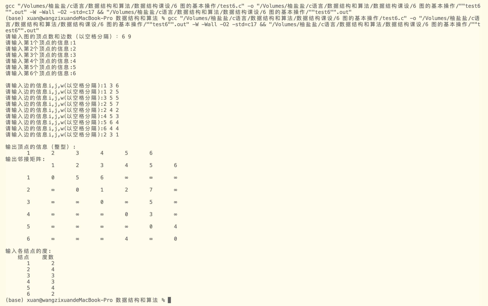

图的基本操作
图的存储结构有邻接矩阵与邻接表
这里采用邻接矩阵存储

图有有向图、无向图，还有带权值和不带权值的
代码都差不多，就几个地方改一下就就行
本文以带权有向图为例
其他修改也有注明

# 1 图的结构
```c
typedef int VertexType; /* 顶点类型应由用户定义  */
typedef int EdgeType;	/* 边上的权值类型应由用户定义 */


typedef struct
{
	VertexType vexs[MAXVEX];	  /* 顶点表 */
	EdgeType arc[MAXVEX][MAXVEX]; /* 邻接矩阵，可看作边表 */
	int numNodes, numEdges;		  /* 图中当前的顶点数和边数  */
} MGraph;
```

# 2 基本操作函数
1. 初始化图
```c
MGraph *InitMGraph()
{
	int n, e, i, j;
	MGraph *MG;

	MG = (MGraph *)malloc(sizeof(MGraph));

	printf("请输入图的顶点数和边数（以空格分隔）：");
	scanf("%d%d", &n, &e);
	MG->numNodes = n;
	MG->numEdges = e;

	for (i = 0; i < n; i++)
		for (j = 0; j < n; j++)
		{
			if (i == j)
				MG->arc[i][j] = 0; //对角线置为0
			else
				MG->arc[i][j] = 32767; //带权图没连接的两点设为正无穷
		}

	return MG;
}
```

2. 图的生成
对角线都是0
对于无向图来说，1为有链接，0为无连接，边表是对称的
对于有向图来说，边表不是对称的
对于带权图来说，连接的边有对应的权值，不连接的边权值为正无穷

```c
void MGraphCreate(MGraph *MG)
{
	int vi, vj, w, i;

	//将顶点存入数组中
	for (i = 0; i < MG->numNodes; i++)
	{
		printf("请输入第%d个顶点的信息:", i + 1); //+1
		scanf("%d", &MG->vexs[i]);
	}
	printf("\n");

	//录入边的信息，修改边表
	for (i = 0; i < MG->numEdges; i++)
	{
		printf("请输入边的信息i,j,w(以空格分隔):");
		scanf("%d%d%d", &vi, &vj, &w);
		//若为不带权值的图，则w输入1
		//若为带权值的图，则w输入对应权值

		MG->arc[vi - 1][vj - 1] = w; //①
		//MG->arc[vj - 1][vi - 1] = w; //②
									 //无向图具有对称性的规律，通过①②实现
									 //有向图不具备此性质，所以只需要①
	}
}
```

3. 输出图
```c
void MGraphPrint(MGraph *MG) //输出邻接矩阵的信息
{
	int i, j;
	printf("\n输出顶点的信息（整型）:\n");
	for (i = 0; i < MG->numNodes; i++)
		printf("%8d", MG->vexs[i]);

	printf("\n输出邻接矩阵:\n");
	printf("\t");
	for (i = 0; i < MG->numNodes; i++)
		printf("%8d", MG->vexs[i]);
	printf("\n");

	for (i = 0; i < MG->numNodes; i++)
	{
		printf("\n%8d", i + 1);
		for (j = 0; j < MG->numNodes; j++)
		{
			if (MG->arc[i][j] == 32767) //两点之间无连接时权值为默认的32767，但输出时为了方便输出 "∞"
				//printf("%8d", 0);
				printf("       ∞");
			else
				printf("%8d", MG->arc[i][j]);
		}
		printf("\n");
	}
}
```

4. 输出各结点的度
```c
void MGraphDegree(MGraph *MG)
{
	printf("输入各结点的度:\n");
	printf("    结点    度数\n");
	int v = MG->numNodes; //顶点数
	//int e = MG->numEdges; //边数

	for (int i = 0; i < v; i++)
	{
		int out = 0, in = 0, k; //记录出度入度个数

		for (int j = 0; j < v; j++)
		{
			//带权图中值为32767或0（对角线）表示不连接，不带权图中0表示不连接
			//不连接的相反情况就是连接
			if (!(MG->arc[i][j] == 0 || MG->arc[i][j] == 32767))
			{
				out += 1;
			}
			if (!(MG->arc[j][i] == 0 || MG->arc[j][i] == 32767))
			{
				in += 1;
			}
		}
		k = in + out; //有向图的度是入度和出度相加
		//k = out; //无向图就用一个就可以了
		printf("%8d", MG->vexs[i]);
		printf("%8d", k);

		printf("\n");
	}
}
```


# 3 整体代码
该程序分为两个文件，"test6_AdjM.h"与"test6.c"            
将数据结构类型定义（typedef）部分与基础操作函数放在头文件`test6_AdjM.h`          
主函数以及其他部分放在`test6.c `中 

## test6_AdjM.h
```c

typedef int VertexType; /* 顶点类型应由用户定义  */
typedef int EdgeType;	/* 边上的权值类型应由用户定义 */


typedef struct
{
	VertexType vexs[MAXVEX];	  /* 顶点表 */
	EdgeType arc[MAXVEX][MAXVEX]; /* 邻接矩阵，可看作边表 */
	int numNodes, numEdges;		  /* 图中当前的顶点数和边数  */
} MGraph;

//图的初始化
MGraph *InitMGraph()
{
	int n, e, i, j;
	MGraph *MG;

	MG = (MGraph *)malloc(sizeof(MGraph));

	printf("请输入图的顶点数和边数（以空格分隔）：");
	scanf("%d%d", &n, &e);
	MG->numNodes = n;
	MG->numEdges = e;

	for (i = 0; i < n; i++)
		for (j = 0; j < n; j++)
		{
			if (i == j)
				MG->arc[i][j] = 0; //对角线置为0
			else
				MG->arc[i][j] = 32767; //带权图没连接的两点设为正无穷
		}

	return MG;
}

// 对角线都是0
// 对于无向图来说，1为有链接，0为无连接，边表是对称的
// 对于有向图来说，边表不是对称的
// 对于带权图来说，连接的边有对应的权值，不连接的边权值为正无穷

//图的生成
void MGraphCreate(MGraph *MG)
{
	int vi, vj, w, i;

	//将顶点存入数组中
	for (i = 0; i < MG->numNodes; i++)
	{
		printf("请输入第%d个顶点的信息:", i + 1); //+1
		scanf("%d", &MG->vexs[i]);
	}
	printf("\n");

	//录入边的信息，修改边表
	for (i = 0; i < MG->numEdges; i++)
	{
		printf("请输入边的信息i,j,w(以空格分隔):");
		scanf("%d%d%d", &vi, &vj, &w);
		//若为不带权值的图，则w输入1
		//若为带权值的图，则w输入对应权值

		MG->arc[vi - 1][vj - 1] = w; //①
		//MG->arc[vj - 1][vi - 1] = w; //②
									 //无向图具有对称性的规律，通过①②实现
									 //有向图不具备此性质，所以只需要①
	}
}

//输出图
void MGraphPrint(MGraph *MG) //输出邻接矩阵的信息
{
	int i, j;
	printf("\n输出顶点的信息（整型）:\n");
	for (i = 0; i < MG->numNodes; i++)
		printf("%8d", MG->vexs[i]);

	printf("\n输出邻接矩阵:\n");
	printf("\t");
	for (i = 0; i < MG->numNodes; i++)
		printf("%8d", MG->vexs[i]);
	printf("\n");

	for (i = 0; i < MG->numNodes; i++)
	{
		printf("\n%8d", i + 1);
		for (j = 0; j < MG->numNodes; j++)
		{
			if (MG->arc[i][j] == 32767) //两点之间无连接时权值为默认的32767，但输出时为了方便输出 "∞"
				//printf("%8d", 0);
				printf("       ∞");
			else
				printf("%8d", MG->arc[i][j]);
		}
		printf("\n");
	}
}

//具体的无向图或有向图，出度或入度只需简单修改代码
void MGraphDegree(MGraph *MG)
{
	printf("输入各结点的度:\n");
	printf("    结点    度数\n");
	int v = MG->numNodes; //顶点数
	//int e = MG->numEdges; //边数

	for (int i = 0; i < v; i++)
	{
		int out = 0, in = 0, k; //记录出度入度个数

		for (int j = 0; j < v; j++)
		{
			//带权图中值为32767或0（对角线）表示不连接，不带权图中0表示不连接
			//不连接的相反情况就是连接
			if (!(MG->arc[i][j] == 0 || MG->arc[i][j] == 32767))
			{
				out += 1;
			}
			if (!(MG->arc[j][i] == 0 || MG->arc[j][i] == 32767))
			{
				in += 1;
			}
		}
		k = in + out; //有向图的度是入度和出度相加
		//k = out; //无向图就用一个就可以了
		printf("%8d", MG->vexs[i]);
		printf("%8d", k);

		printf("\n");
	}
}
```

## test6.c
```c
#include <stdio.h>
#include <stdlib.h>

#define MAXVEX 100 //定义最大容量

#include "test6_AdjM.h"


int main()
{
	MGraph *MG = InitMGraph();

	MGraphCreate(MG);

	MGraphPrint(MG);

	MGraphDegree(MG);
	return 0;
}
```

# 4 运行结果

